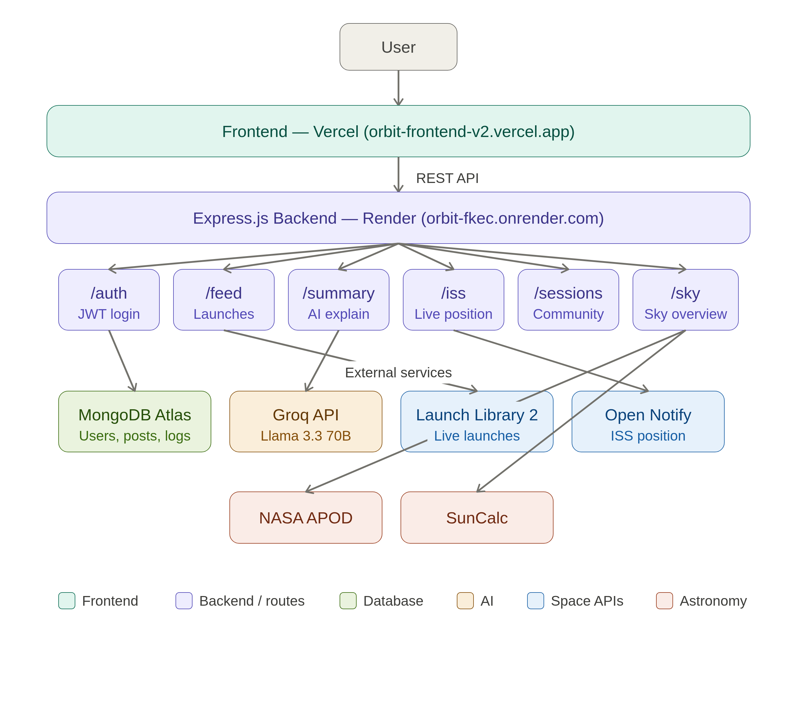

# Orbit — Your Shared Portal to the Cosmos

A personalized space companion that tells you what is happening in space right now, explains it in plain English via AI, and connects you with people nearby to watch it together.

**Deployed App:** https://orbit-frontend-v2.vercel.app  

---

## What it does

Orbit is built for anyone curious about space — from complete beginners to dedicated enthusiasts. The platform pulls live data from space agencies around the world, runs it through an AI model to strip out the jargon, and wraps it in a community layer where people can organize real-world stargazing meetups.

### Live space feed
Real-time launch data from Launch Library 2, NASA, and ISRO. Every event gets a two-sentence plain English summary generated by Groq (Llama 3.3 70B) — what launched, why it matters, what to watch next.

### ISS live tracker
Real-time ISS position rendered on an interactive 3D globe built with Three.js. Includes an AR sky pointer that uses your phone's compass to point you toward the station, a visibility checker that tells you whether conditions are right to spot it tonight, and time dilation facts about what astronauts experience.

### Community stargazing sessions
Users post where they are going and what they plan to watch. Others nearby can see it, join, and coordinate gear in a simple event chatroom. Location-tagged meetup board for space enthusiasts.

### Space photography gallery
Community astrophotography showcase with Stardust gifting, weekly themed challenges, and dark-sky location data crowdsourced from photo EXIF metadata.

### Time dilation trading game
Players choose a relativistic trip — a speed or a distance from a massive object — and see real physics-based outcomes. Before departing, they place predictions on real space data trend charts. Two clocks diverge during the trip: ship time versus home time.

### Cosmic passport
A personal log of real sightings — ISS passes, meteors, planets, auroras — that builds into a visual constellation of your sky-watching history over time.

### Stardust economy
Non-monetary internal currency earned through real-world engagement: attending sessions, accurate predictions, verified observations. Spent on game stakes, session visibility boosts, and community gifting. All balance changes flow through an append-only ledger.

### Beginner's corner
Static educational pages explaining stars, satellites, and space fundamentals in plain language. No prior knowledge required.

---

## Architecture

```
User
 |
 v
Frontend (Vercel)
 |  HTML / CSS / JavaScript
 |  orbit-frontend-v2.vercel.app
 |
 | REST API calls
 v
Backend (Render)
 |  Node.js + Express.js
 |  orbit-fkec.onrender.com
 |
 |--- /auth          JWT register and login
 |--- /feed          Live launch data
 |--- /summary       AI-generated plain English summary
 |--- /iss           Live ISS position
 |--- /sky           Personalized sky overview
 |--- /sessions      Community stargazing sessions
 |--- /photos        Astrophotography gallery
 |--- /passport      Cosmic passport logs
 |--- /stardust      Stardust economy ledger
 |--- /markets       Time dilation trading game
 |
 |--- MongoDB Atlas      Users, posts, sessions, ledger
 |--- Groq API           Llama 3.3 70B for launch summaries
 |--- Launch Library 2   Live rocket launch data
 |--- Open Notify        Live ISS position
 |--- NASA APOD          Astronomy picture of the day
 |--- SunCalc            Sun and moon position calculations
```




---

## Tech stack

| Layer | Technology |
|---|---|
| Frontend | HTML, CSS, JavaScript |
| Backend | Node.js, Express.js |
| Database | MongoDB Atlas |
| AI | Groq API (Llama 3.3 70B) |
| 3D and VR | Three.js, A-Frame |
| Real-time chat | Socket.io |
| Space data | Launch Library 2, Open Notify, NASA APOD, SunCalc |
| Auth | JWT |
| Deployment | Vercel (frontend), Render (backend) |

---

## Project structure

```
orbit/
├── backend/
│   ├── index.js           Entry point, mounts all routes
│   ├── db.js              MongoDB Atlas connection
│   ├── routes/            One file per API resource
│   ├── models/            Mongoose schemas
│   ├── services/          Business logic and external API calls
│   ├── middleware/        JWT auth middleware
│   └── .env.example       Required environment variables
└── frontend/
    ├── index.html         Login and signup
    ├── workshops.html     Main dashboard
    ├── iss.html           ISS tracker with 3D globe
    ├── community.html     Stargazing session board
    ├── photography.html   Astrophotography gallery
    ├── passport.html      Cosmic passport
    ├── vr.html            VR and immersive simulations
    ├── long-horizon-exchange.html   Time dilation game
    ├── api.js             Shared API client
    └── session.js         Auth session manager
```

---

## Local setup

Prerequisites: Node.js 18+, a MongoDB Atlas account, a Groq API key (free at console.groq.com).

```bash
cd orbit/backend
npm install
```

Create a `.env` file using `.env.example` as a template:

```
MONGO_URI=your_mongodb_atlas_connection_string
GROQ_API_KEY=your_groq_api_key
JWT_SECRET=your_jwt_secret
PORT=3000
CLIENT_ORIGIN=http://localhost:3000
```

```bash
nodemon index.js
```

Open `orbit/frontend/index.html` in a browser or serve the frontend folder with any static file server.

---

## API reference

| Method | Endpoint | Description |
|---|---|---|
| POST | /api/auth/register | Create account |
| POST | /api/auth/login | Login and receive JWT |
| GET | /api/feed | Live launch feed |
| GET | /api/summary | AI summary of latest launch |
| GET | /api/iss | Live ISS coordinates |
| GET | /api/sky/overview | Personalized sky data for your location |
| GET | /api/sessions | All community sessions |
| POST | /api/sessions | Create a stargazing session |
| GET | /api/photos | Astrophotography gallery |
| GET | /api/passport | Cosmic passport entries |
| GET | /api/stardust/me | Stardust balance and ledger |
| GET | /api/markets | Time dilation trading markets |

---

## Team

Built at ArcNight 2026, Microsoft Innovations Club, VIT Chennai.

---

## License

MIT
